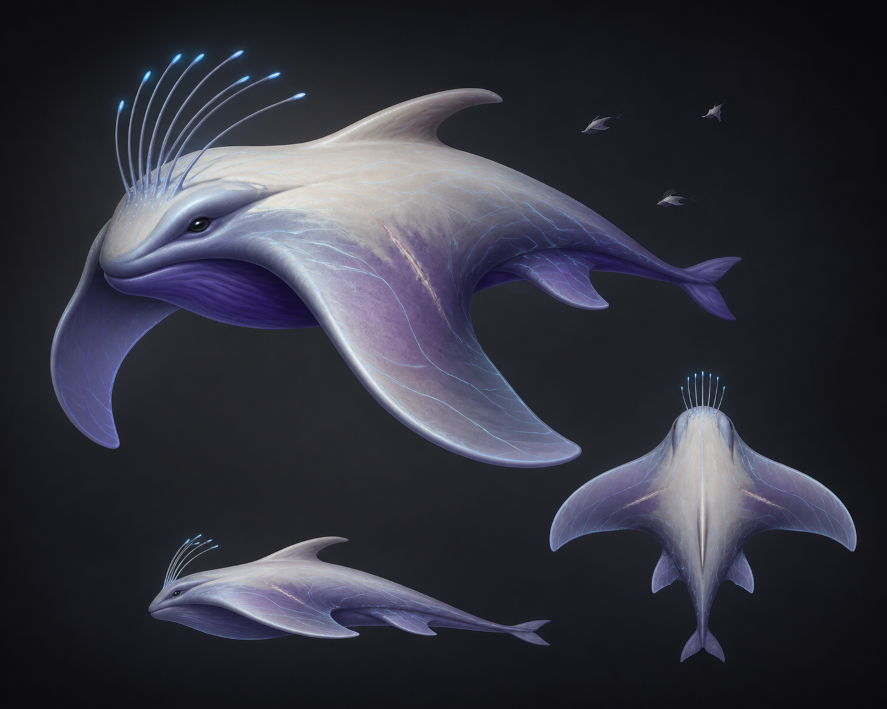
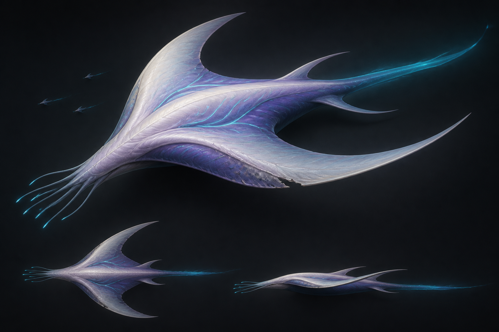
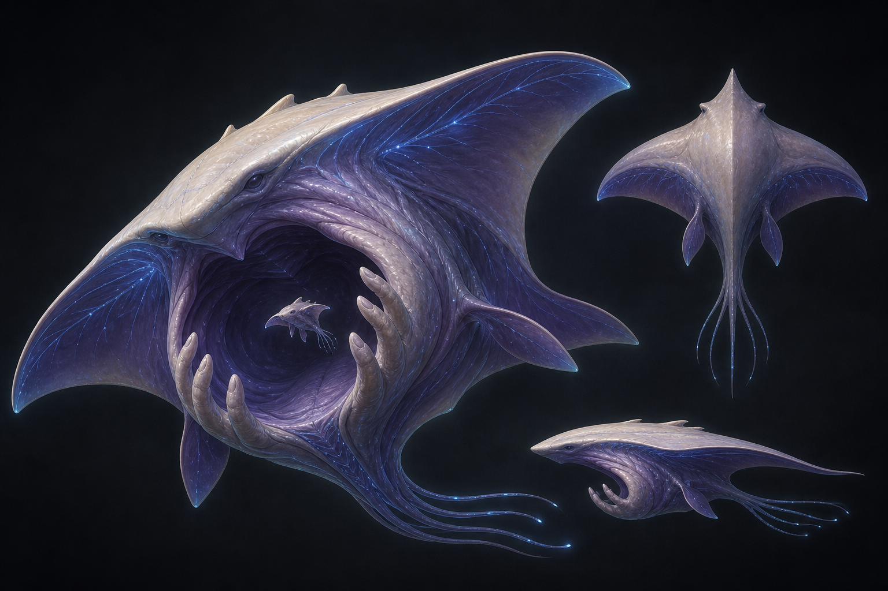
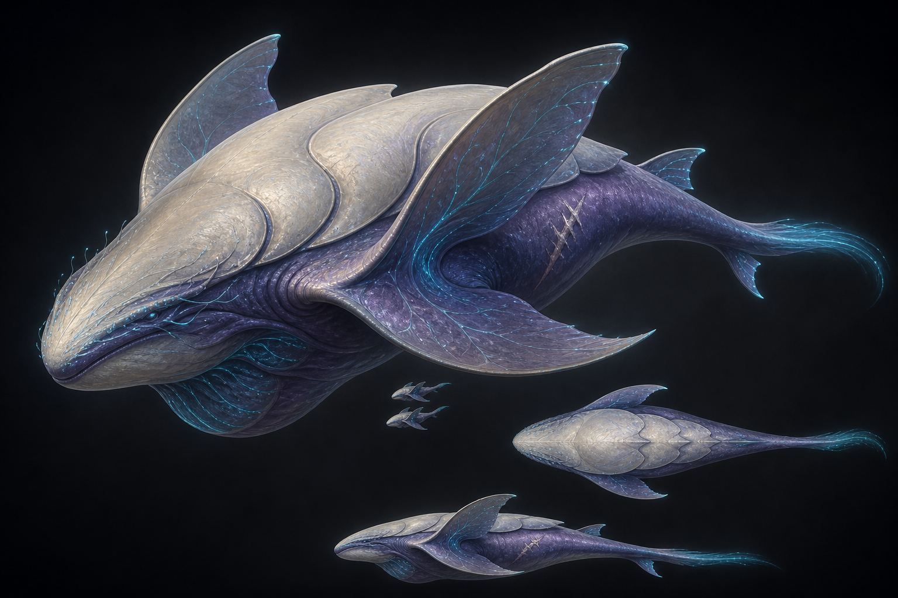
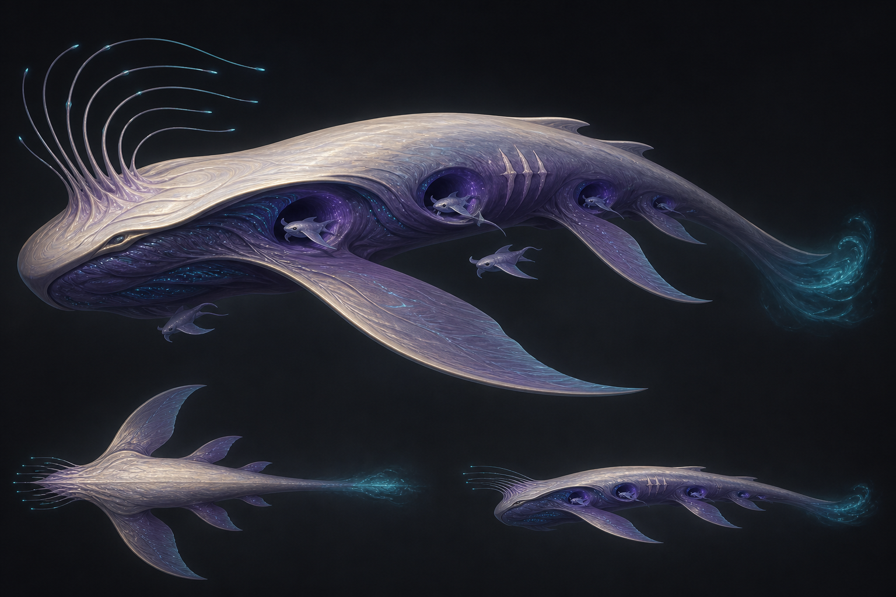
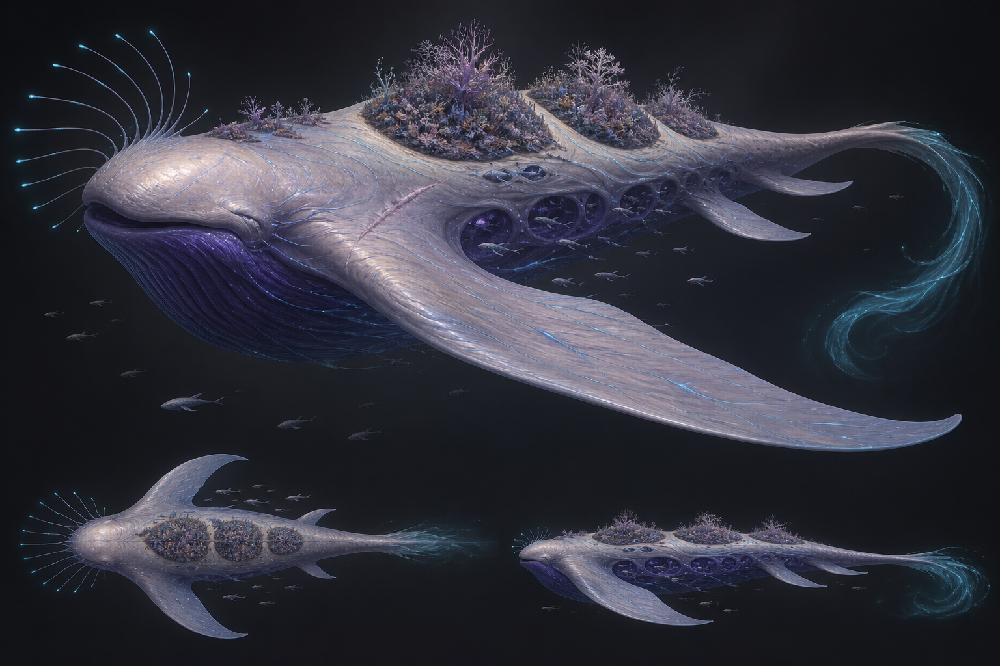

# The Beautiful Ones — ship-class image references

These six plates explore the Beautiful Ones as living kin rather than organic machines. They share one visual lineage: a continuous manta–whale body, squid-like sensory anatomy, pearl-bone dorsal tissue, violet-indigo flanks, and fine cyan bioluminescence. They intentionally avoid cockpits, windows, engine nozzles, turrets, panel lines, and conventional spacecraft construction.

The images are concept references, not literal model sheets. Their strongest ideas should guide silhouette, posture, color blocking, and biological function. Where a generated detail conflicts with the design bible or current ship builders, the written notes below identify the conflict.

## Shared visual language

- **Silhouette:** Broad manta fins and a continuous cetacean body establish the faction at thumbnail size. Secondary fins change by age and role.
- **Head:** The rounded or tapered forebody reads as an animal's sensing end, not a cockpit. Fine crown filaments add squid-like awareness.
- **Surface:** Dorsal nacre is warm pearl with subtle cream and lavender iridescence. The flanks and belly deepen through mauve into indigo-violet.
- **Light:** Cyan appears as thin nerves, nodes, crown tips, and a diffuse wake. It is anatomy, never strip lighting.
- **Motion:** Curved fins, compliant membranes, and tapering tails imply swimming through space. Even still images should suggest breath and a traveling body wave.
- **Emotional read:** Tender, self-possessed, and intelligent. None of the ships should resemble wounded flesh, parasites, insects, or body-horror monsters.
- **Construction warning:** Visible eyes in these paintings are an interpretive concept-art choice, not a requirement of the current builders. If retained, they should remain subtle sensory organs rather than cockpit analogues.

## Light — Young Wayfinder

The Light is the most youthful and immediately animal-like plate. Its dominant view combines a dolphin's raised brow and friendly facial line with the wide, flexible pectoral plane of a manta. The body is compact and thickest around the shoulders, then narrows quickly into a short tail ending in a small whale-like fluke. A second, smaller fin pair sits near the tail root, keeping the animal complete rather than making the rear body look cut off.

Warm pearl tissue covers the crown, spine, and most of the upper wing surfaces. Lavender and indigo collect beneath the wing folds and across the belly. Fine cyan lines branch sparingly over the body and fins, while the sensory crown ends in brighter blue droplets. The material appears dry and satin-like, with a faint translucent quality along the fin margins.

The crown is the clearest class cue: a curious fan of long, fine filaments rises from the forehead and leans forward. The large hero view also shows a pale diagonal scar on the near flank. Its placement and low contrast make it read as healed experience rather than injury. Three tiny distant juveniles reinforce the social, living-fleet idea without competing with the primary design.

The supporting top view confirms a broad diamond-like manta plan, while the side view shows a raised dolphin-like back, a low belly, and a short afterbody. Relative to the implementation brief, the painting gives the ship a more obvious eye and dolphin face, and its top fin reads slightly more like a dorsal fin than a soft dorsal crest. The broad forward wings, aft pair, tail fluke, crown, pearl/indigo split, and restrained scar all align strongly with the Young Wayfinder builder.

## Ace — Swift-Bonded Hunter

The Ace is a taut, low dart-manta organized around speed. Its nose is narrow and pointed, the body stays slim through the thorax, and the tail stretches into a long blue-violet wake. The enormous forward fin pair sweeps dramatically aft and becomes the entire silhouette. A smaller second pair echoes the same direction near the tail, creating a repeated flow that feels grown for rapid whole-body propulsion rather than fitted with engines.

Unlike the Light's raised crown, the Ace carries a low fan of flexible sensing filaments projected from the nose. Their cyan tips visually continue the nerve paths that curve backward through the shoulders. Those luminous lines are brighter and more concentrated than on the other small classes. They form flowing S-curves rather than a mechanical grid, making the ship look as if a traveling muscular wave is passing from head to tail.

The port-side main fin has an irregular, shortened trailing region and a rough healed edge. This is the most legible asymmetry in the plate. The opposite side remains long and clean, giving the craft the controlled imbalance described in the class brief. Tiny formation companions at upper left provide scale and reinforce that the Ace is a specialized adult rather than a lone monster.

The lower top and side studies are especially useful modeling references: the top view shows the severe fin sweep and narrow center body; the side view reduces the ship to a thin undulating ribbon with almost no frontal mass. The concept is somewhat sharper at the fin tips than the faction's preferred rounded paddles, so final geometry should soften those ends. The nose filaments also verge on cephalopod arms; keeping them fine and sensory, rather than muscular or grasping, will preserve the intended crown read.

## Cutter — Guardian

The Cutter is built around an embrace. The large ventral hero view reveals a broad adult manta whose lower body opens into a sheltered circular cradle. Three thick, soft grasping digits rise from each side of that cavity, curving inward but leaving a generous open center. A small juvenile floats safely within the hold, immediately communicating rescue, transfer, or caregiving rather than capture.

The pearl tissue forms a calm dorsal cap and follows the leading edges of the fins. The inner wing membranes and cradle folds are deep violet, crossed by a sparse blue nerve lattice. Bright nodes remain tiny and localized. Several smaller fins step backward along the tail, while a group of long sensory streamers trails from the head and lower body.

The supporting views clarify the relationship between the familiar manta silhouette and the unusual ventral organ. From above, the Guardian is a broad, reassuring ray with a long clean spine. In profile, the cradle hangs below the forward body like a protected pouch, with the grasping digits cupped upward.

The open cavity is visually successful but is also the plate's main caution: the upper fold, shadowed chamber, and finger row can read as a large mouth with teeth. The model should keep the central hold clearly open, round the fingers into flexible whale- or sea-lion-like pads, avoid an enclosing upper “jaw,” and emphasize soft docking lips around the belly chamber. The juvenile scale cue and upward/inward finger posture are worth preserving exactly.

## Heavy — Shieldback

The Heavy has the broad head, deep chest, and slow authority of a whale. Its central body is substantially taller and denser than the other combat-capable classes. Two enormous shield fins rise steeply from thick roots, framing the torso like protective walls. A smaller lower pair continues the manta lineage without weakening the compact defensive mass.

Three overlapping pearl mantle regions cover the dorsal body from brow to mid-back. Their large scale gives the ship a shieldback identity before any fine detail is visible. Indigo-violet tissue remains exposed along the flanks, belly, tail, and undersides of the fins. Cyan threat-display veins gather most strongly around the shield-fin roots and deep mantle folds, so the glow appears to originate inside loaded muscular structures.

The snout is blunt and slightly downturned. The crown is reduced to a low sweep of short sensing filaments along the forward edge, giving the Heavy a watchful posture rather than the Light's curiosity. A protected ventral pouch adds weight beneath the thorax. Several pale diagonal welts on the near aft flank provide a restrained history mark, and two very small companions make the main body feel mature and massive.

The dorsal mantles are the main translation risk. In the painting, their borders are crisp enough to resemble fitted shell plates. The final model should keep them visibly swollen, interpenetrating body masses with soft biological transitions—more overlapping whale muscle or ray cartilage than armor panels. The raised shield fins, dense height, blunt head, concentrated fold glow, and tail wake are otherwise strong references for the Shieldback.

## Frigate — Elder Guardian

The Frigate is a long, calm elder whose body carries a community. Its pearl dorsal surface forms an uninterrupted shallow arch from a broad forehead into a tapering back. The indigo belly hangs deeper than on the smaller classes, producing a serene whale-like profile. Multiple fin pairs coordinate along the body: a vast forward pair supplies the primary manta silhouette, while progressively smaller fins mark the long passage toward the tail.

Four purple sanctuary hollows open along the visible flank. Each is a softly recessed circular chamber rather than a mechanical hangar. Juvenile manta-like companions occupy the forward hollows and move around the elder; the aft chambers remain darker and more open. Violet rims and subdued interior glow make the spaces feel sheltered, breathable, and alive. Fine blue nerves and vent lights collect under the dorsal overhang rather than covering the calm pearl back.

The sensory crown is deep and ancient: long filaments sweep from the forehead in a wide, slow fan, their cyan tips held far from the face. Three pale scar ridges lie together on the upper near flank, giving a clear history mark without breaking the body into armor. At the stern, the physical tail dissolves into a curled cyan wake with no visible nozzle.

The supporting top view is useful for counting the coordinated fin stages, while the side study exposes the nursery rhythm and long elder proportions. The generated plate makes the flank hollows more numerous and more perfectly circular than the current four-hollow brief. Production geometry should retain two nursery and two open sanctuary hollows total, keep their lips irregular and grown, and avoid a repeated row that could read as manufactured bays.

## Freighter — Gardenback Migration Vessel

The Freighter is a migrating ecosystem on the body of a colossal whale-manta. The hero view is dominated by a blunt pearl brow, an immense dark throat, and a forward wing that sweeps across most of the plate. The thorax is far broader and deeper than the Frigate's, then narrows through a long tail into a vast curling cyan wake. Dozens of juvenile ships surround it, and their consistent tiny scale makes the carrier feel genuinely enormous.

Three separated garden regions rise from the dorsal surface. Each grows from folded pearl tissue and supports branching lavender coral forms, low clustered fronds, and small orchid-like organisms. Bare breathing gaps remain between the gardens, so they read as distinct symbiotic biomes rather than one decorative forest. The palette stays within the faction family: nacre and mauve above, indigo beneath, with cyan capillaries traveling through the body and fins.

A row of deep violet nursery hollows runs along the visible flank. Several contain clearly nested juvenile organisms, while others open into shadowed sheltered space. Smaller companions swim alongside and beneath the hull, turning the carrier into the center of a living migration rather than a cargo vehicle. The long crown filaments fan outward from the brow and end in cool blue points. A pale scar crosses the upper forward flank without becoming a wound.

The top and side studies reinforce the separation between the dorsal gardens, the great wing pair, smaller aft fins, and the long carrier body. The garden texture is denser and more coral-like than the current builder's fold-and-frond language, so it should be simplified into larger, readable garden ridges at game scale. The plate also shows more flank hollows than the authored model. Preserve the sense of a populated nursery, but use the implementation's bounded hollow count and rely on nearby companions to carry the scale cue.

## Set-level takeaways

The plates form a readable life-stage and role ladder:

1. **Light:** compact, curious, crown-forward, and closest to a young dolphin-manta.
2. **Ace:** thinnest and most swept, with the strongest sense of a traveling body wave.
3. **Cutter:** broad and socially protective, defined by its ventral cradle.
4. **Heavy:** deepest and densest, defined by raised shield fins and muscular dorsal mantles.
5. **Frigate:** long and calm, defined by coordinated fin pairs and sanctuary hollows.
6. **Freighter:** overwhelmingly large, defined by symbiotic gardens, nurseries, and migration companions.

Across implementation, favor the plates' silhouette hierarchy, soft color transitions, localized bioluminescence, and emotional posture. Treat eyes, perfectly circular hollows, sharp fin tips, mouth-like cavities, and shell-like mantle borders as optional concept-art artifacts that need deliberate correction before becoming canonical geometry.

## Generation record

The six images were generated with the built-in image-generation workflow as separate class-specific prompts. Each prompt used the `stylized-concept` use case, the shared art direction above, a dark neutral reference-plate backdrop, a dominant three-quarter view with supporting top and side studies, and class anatomy derived from `docs/FactionShipDesignBible.md` and `scripts/ship_builders/beautiful/`.

### Final prompt set

Every prompt shared this core: “Create a premium painterly-realism spaceship design reference plate showing one coherent Beautiful Ones creature-ship in a dominant three-quarter hero view and two smaller top/side studies. Use a continuous manta–whale–cephalopod body, pearl-bone dorsal membrane, violet-indigo flanks, restrained cyan nerves, dry satin nacre, and translucent fin edges. Convey majestic animal intelligence, tenderness, breath, and self-directed motion. No hard edges, panels, seams, rivets, armor plates, cockpit, windows, engine nozzles, barrels, mechanical weapons, text, logos, body horror, exposed organs, teeth, gore, insectoid anatomy, or conventional aircraft.”

The class-specific requests were:

- **Light:** A small curious juvenile combining manta and dolphin anatomy, with broad forward wings, smaller aft fins, tiny tail flukes, soft cephalic lobes, a lifted throat, an eight-filament crown, and one port scar.
- **Ace:** A narrow, low, sinuous dart-manta with extremely swept forward fins, a smaller aft pair, strong S-curved nerve folds, a flat crown, a shortened healed port fin, and a starboard aft scar.
- **Cutter:** A broad protective adult shown from below, with a six-finger open rescue cradle, empty hold channel, sheltered belly chamber, docking folds, moderate crown, and one port-forward scar.
- **Heavy:** A dense whale-like defender with three overlapping muscular dorsal mantles, raised shield fins, concentrated threat-display veins in deep folds, a protected belly pouch, flat crown, and one port-aft scar.
- **Frigate:** A long calm elder with four decreasing fin pairs, four flank sanctuary hollows, nested juveniles in the forward pair, subdued fold light, a deep crown, and three port-side scars.
- **Freighter:** A colossal blunt whale-manta with three separated dorsal garden biomes, multiple nursery and sanctuary hollows, a great belly chamber, ancient crown, three fin pairs, a port scar, and dozens of consistently tiny migrating companions.
