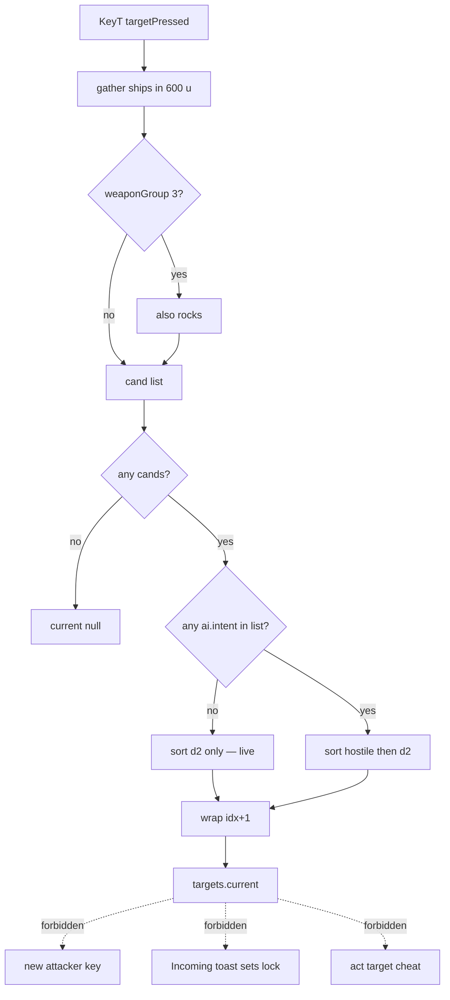

# RIMWARD TGT-07 combat cycle

| Field | Value |
|---|---|
| **Title** | RIMWARD TGT-07 combat cycle |
| **Author** | Wave 130 TGT leftover integrator |
| **Date** | 2026-08-26 |
| **Status** | Wave 130 markdown only. Leftover **REAL**. Named serial **PR1**. Merge law: shared-contract.md wins. |
| **Wave** | 130 — PR1 named only (`cycleTarget` hostiles-first then range). KeyT stays the cycle key. No `src/`. |
| **Owner request** | Inbox P2 TGT leftover: Sort the T target cycle hostiles-first during combat, or add a “target my attacker” key. Census live `cycleTarget`, KeyT, TGT-03 warnings, KeyV, hostile flags, Q-ship cover. Code wins. If KeyT already cycles hostiles-first while a hostile is in envelope **or** a dedicated attacker-lock binding already exists, freeze leftover **CONSUME** and named serial **none**. Census: **not** live. Freeze leftover **REAL** and name later serial **PR1**. Prefer changing cycle **order** over a new key. One law in PR1. TGT-06 remaining leftover is **CONSUME** — this inbox item is a **new hole** after that census. |
| **Merge law** | [`out/w130/tgtcycle/shared-contract.md`](../out/w130/tgtcycle/shared-contract.md). If this document and that file conflict, **the contract wins**. |
| **Honor** | HUD-01 empty 80 px hub. Aim-glass gauges stay off. Kit mutate omit. Digit 0/8/9 stay. KeyH/J/L/M/P stay. KeyT cycle ships (rocks group 3). KeyV/KeyX/KeyK stay. `state.js` READ-ONLY later. No new WORLD_FIELDS. No UU. No SKU. `innerHTML` forbidden later. Do not invent a hub PPI. Do not invent aim-glass gauges. Incoming fire toast/gauge: cite TGT-03; do not steal. Q-ship cover class stays HUD-02. Station/gate/pod/landmark KeyV locks stay TGT-05. Do not “fix” known REDMARCH `castMatches` flake. Do not steal Agent API `act({name:'target'})` beyond live cycle rules. Do not steal sibling Wave 130 packs (NAV-10 dock approach, MSN-04 job dedup). Do not steal optional PR2s (Agent API, Hail01, HUD-06, Hail02, HUD-07, NAV-09, CTL-03, AI-05, CTL-04). |

**Verifier record:**

| Note | Path |
|---|---|
| Inventory (code wins; Wave 130 census) | [`out/w130/tgtcycle/current-tgt07-combat-cycle-inventory.md`](../out/w130/tgtcycle/current-tgt07-combat-cycle-inventory.md) |
| Merge law | [`out/w130/tgtcycle/shared-contract.md`](../out/w130/tgtcycle/shared-contract.md) |
| Wave 130 security review | [`out/w130/tgtcycle/security-review.md`](../out/w130/tgtcycle/security-review.md) |
| Wave 130 design-doc review | [`out/w130/tgtcycle/code-review.md`](../out/w130/tgtcycle/code-review.md) |
| Wave 130 UI audit | [`out/w130/tgtcycle/ui-audit.md`](../out/w130/tgtcycle/ui-audit.md) |
| Wave 130 notes | [`out/w130/tgtcycle/notes.md`](../out/w130/tgtcycle/notes.md) |

Siblings TGT-03/05/06, HUD-06/07, NAV-10, MSN-04, Agent API, Hail01/02, wishlist, and `PROGRESS.md` are **other workers**. **Do not edit** those paths. **Do not** write `src/`. **Do not** steal sibling Wave 130 paths. **Do not** write `out/w130/tgtcycle/verify/**`.

**This is not TGT-03 Incoming fire.** **This is not TGT-05 KeyV.** **This is not TGT-06 remaining instruments.** **This is not a hub PPI.** Wishlist TGT-03 attacker warnings are **live as toast**; selection priority is **INBOX**.

---

## Overview

Inbox source (`docs/PLAYER-EXPERIENCE-WISHLIST.md` Playtest capture 2026-08-25 second pass — **180–183** — **cite, do not edit**):

> INBOX (P2, TGT): Sort the T target cycle hostiles-first during combat, or add a "target my attacker" key. While an ace fired from 59 u, T selected a friendly hauler, then a neutral freighter, and reached the attacker on the third press. TGT-03 lists attacker warnings but not selection priority.

Sibling remaining TGT (`docs/Tgt06RemainingTgtDesign.md`) is leftover **CONSUME**. Wave 122 found named slices live. This pack does **not** reopen PPI / incoming gauge. This inbox item is a **new** player-facing hole: **cycle order**.

Wave 130 this worker lands markdown only. Bindings do not change here.

Census (code wins): `cycleTarget` (`controls.js` **114–142**) gathers in-range ships (rocks if weapon group 3) and sorts by `d2` **only**. KeyT pulses `targetPressed` (`controls.js` **324–325**, **424**, **457**). No attacker-lock key. TGT-03 ships `Incoming fire.` without selecting the shooter (`npc-fire-toast.js` **8–64**; `combat.js` **1797** omits shooter). HUD contacts **already** rank `ai.intent` then dist (`hud.js` **1734–1751**) — display only. Leftover is **REAL**.

This leftover is **KeyT hostiles-first then range** while a hostile sits in the 600 u envelope. It is not a new Digit. It is not Incoming toast lock. It is not KeyV.

This document is the integrator for a **later** implementation wave.

HUD-01 empty aim glass stays empty. `state.js` stays READ-ONLY. No new persist key. Digit 0/8/9 stay. KeyH/J/L/M/P stay. KeyT stays cycle. Do not invent UU. Do not steal TGT-03. Do not claim `hud.js` layout.

Wave 130 deputize (recorded here and in the contract; owner may override after playtest): law **(a)** gated hostiles-first then range on KeyT; hostile = `ai.intent === true`; gate = in-envelope cycle candidate; wrap live; rocks group-3 non-hostile; no new key; optional help line. Fail-closed.

If census had proved hostiles-first already live **or** an attacker-lock key already existed, this pack would freeze **CONSUME** and name serial **none**. Census did not. That CONSUME path is unexpected.

---

## Background & Motivation

### Current state (inventory)

Source of truth: [`out/w130/tgtcycle/current-tgt07-combat-cycle-inventory.md`](../out/w130/tgtcycle/current-tgt07-combat-cycle-inventory.md). Code wins.

| Surface | Today | Cite |
|---|---|---|
| KeyT pulse | `input.targetPressed` one frame | `controls.js` **324–325**, **424** |
| Cycle | nearest `d2` then wrap | `controls.js` **114–142**, **457** |
| Envelope | 600 u | `state.js` **32** |
| Rocks | group 3 only | `controls.js` **128–134** |
| Hostile in cycle | **none** | sort **139** |
| `ctx` comment | “cycle nearest hostiles” (**lie**) | `ctx.js` **88** |
| Help | `'T — cycle target'` | `controls.js` **406** |
| Attacker key | **absent** | TRACKED **46–53** |
| Intent | `ai.intent` toward player | `npc.js` **247**, **1696**, **2203** |
| `flags.combat` | intent inside 800 u | `npc.js` **2680–2684** |
| HUD contacts sort | lock → hostile → dist | `hud.js` **1734–1751** |
| Incoming fire. | toast, no lock | `npc-fire-toast.js` **8–64** |
| `playerHit` | no shooter field | `combat.js` **1797** |
| KeyV kinds | station/gate/pod/landmark | `controls.js` **148–151**, **258–274** |
| Q-ship cover | `coverClass` / masked name | `hud.js` **127–129**, **2417** |
| Agent `target` | unknown | `agent-api.js` **150** |
| TGT-06 leftover | CONSUME | `docs/Tgt06RemainingTgtDesign.md` |

The player who taps T while an ace fires from 59 u and a hauler sits closer gets the **hauler**. A second T gets the next-nearest (often a neutral). The ace waits. TGT-03 already said “Incoming fire.” The lock did not follow.

### Pain points

- Nearest-first impersonates “T targets the threat” because `ctx.js` **88** and play feel say hostiles, while the sort is meters.
- HUD contacts already put hostiles first; KeyT **disagrees**. Two instruments, two orders.
- A naive later PR that adds a “target attacker” key steals TRACKED letters (V/X/K live) or invents a Digit.
- A naive later PR that locks from Incoming toast **steals TGT-03** and HUD-04.
- A naive later PR that uses pirate/ace **role** without intent jumps to a fleeing hull.
- A naive later PR that uses `save.js` `ai.hostile` reads a bit `makeAi` never writes.
- A naive later PR that unmasks Q-ship class to “know” a cutter fights HUD-02.
- A naive later PR that adds `act({name:'target'})` **cheats** envelope.
- A persist “always lock hostiles” impersonates the owner.
- Inventing a hub PPI as leftover fights TGT-06 CONSUME and HUD-01.

### Why now (design) / why not now (code)

The owner asked for the TGT-07 leftover integrator so a later serial can change **cycle order** before anyone ships a new key, a toast lock, or a PPI. Inventory shows d2-only sort and no attacker key. Merge law can exist without touching `src/`. Implementation waits so dual-law, TGT-03 theft, Agent cheat, Q-ship pierce, and persist auto-lock are frozen before the first sort change. Wave 130 this worker does not ship `src/`.

If census had proved the cycle already hostiles-first, this pack would freeze **CONSUME** and name serial **none**. Census did not.

---

## Goals & Non-Goals

### Goals

1. Document live KeyT, `cycleTarget` d2 sort, missing attacker key, `ai.intent`, `flags.combat` vs envelope, HUD contacts sort, TGT-03 toast, KeyV kinds, Q-ship cover, Agent absence from **live code**.
2. Freeze leftover = **KeyT hostiles-first then range**. Not Incoming toast. Not a new key. Not TGT-06 PPI.
3. Freeze deputize: one law (a); hostile = `ai.intent`; gate = in-envelope hostile candidate; wrap live. Owner may override after playtest. Do not park.
4. Freeze persist: **none** new. `state.js` READ-ONLY. No UU. No SKU. No new Digit.
5. Freeze HUD-01 empty hub. Digit 0/8/9 stay. KeyT/V/X/K stay. KeyH/J/L/M/P stay.
6. Freeze later help via `textContent` strings. `innerHTML` forbidden.
7. Freeze a serial PR plan. This wave writes the document. A later wave ships serially.

### Non-goals (locked — do not reopen)

- No `src/` or live bindings in this worker.
- No new TRACKED key. No KeyV/X/K remap.
- No TGT-03 Incoming copy / gap / second live region. No incoming gauge.
- No HUD-06 home marker. No HUD-07 layout. No `hud.js` contacts rewrite.
- No Agent `act target` off-gates. Do not edit `docs/AgentApiDesign.md`.
- No AI-05 pirate interest/spawn retune. No `npc.js` intent rewrite.
- No `combat.js` `playerHit` shooter field (law (b) by stealth).
- No `state.js` write. No WORLD_FIELDS. No new Digit.
- No hub PPI. No aim-glass gauge. No kit mutate.
- Do not edit the wishlist, `PROGRESS.md`, `docs/Tgt03*.md`, `docs/Tgt05*.md`, `docs/Tgt06RemainingTgtDesign.md`, OwnerDecisions*.
- Do not write `out/w130/tgtcycle/verify/**`.
- Do not fix REDMARCH `castMatches`.
- Do not steal sibling Wave 130 packs.

---

## Proposed Design

### 1. Merge resolutions (contract wins)

| Question | Integrator freeze | Why |
|---|---|---|
| Leftover real? | **Yes** | Inventory §10 |
| CONSUME? | **No**. Serial is **not** none | Census d2-only; no attacker key |
| New persist key? | **No** | Contract §0.5 |
| `state.js` write? | **No** | Contract §0.5 |
| New key / law (b)? | **No** in PR1 | One law; prefer cycle order |
| Hostile bit? | `ai.intent === true` | AI-04 / HUD contacts |
| Gate? | in-envelope hostile cand | 600 u, not 800 u bubble alone |
| Steal TGT-03 toast? | **No** | Honor |
| Agent `act target`? | **No** | Contract §0.18 |
| Named PR1? | **PR1** combat cycle | REAL leftover |

### 2. Current cycle motion (do not break KeyV / TGT-03 / rocks)

KeyT still pulses one frame. Gather still ships in 600 u, rocks if group 3. Destroyed still skip. Wrap still `(idx + 1) % n`. KeyV still cone-12 kinds. Incoming still toasts without lock. Contacts arc still ranks hostiles for **display**.

### 3. Deputize table (copy of contract §0.1)

Owner may override after playtest. Do not park.

| Knob | Value |
|---|---|
| Law | (a) hostiles-first then range on KeyT |
| Hostile | `ai.intent === true` on a live ship cand |
| Gate | ≥1 such cand in 600 u |
| Else | live d2-only |
| Wrap | live; **not** skip-to-attacker |
| Rocks | group 3; never hostile bucket |
| Kinds | KeyV only |
| Help | optional `'T — cycle target (hostiles first in combat)'` |
| Persist | none |
| Home | `controls.js` `cycleTarget` (+ help / ctx comment) |

### 4. Neighbours

| Module | This leftover does | This leftover does not |
|---|---|---|
| `controls.js` | later PR1: gated sort in `cycleTarget`; optional help | remap V/X/K; new TRACKED; kinds in T |
| `ctx.js` | optional comment fix line **88** | input schema change |
| `hud.js` | **none** required | contacts sorter; toast; hub; prompt |
| `npc.js` | **none** | intent / hunt / interest |
| `combat.js` | **none** | `playerHit` shooter |
| `npc-fire-toast.js` | **none** | Incoming copy |
| `agent-api.js` | **none** | `act target` |
| `state.js` | none | write / range retune |
| `reticle-aim.js` | none | cone |

### 5. Serial PR plan

Matches contract §3. **Named only. Do not implement in Wave 130.**

| PR | Lands | Does not land |
|---|---|---|
| **PR1** combat cycle | gated hostiles-first sort; wrap live; rocks/kinds honor; optional help + ctx comment | new key; Incoming lock; Agent target; HUD layout; persist; Digit; `innerHTML`; npc/combat |
| **PR2 stills (optional)** | playtest stills | required with PR1 |
| **PR3 census (optional skip)** | re-grep d2-only as sole sort gone | new world field |

First remaining serial is **PR1**. It must not steal Digit 0/8/9. It must not write `state.js`. It must not claim `hud.js` layout or `agent-api.js`. Do not land law (b) as required PR1.

### 6. Picture

Reuse the live KeyT pulse. No new Digit. No hub pip. A player who taps T from an empty lock while an ace fires at 59 u and a hauler sits closer **locks the ace first**. A player in calm traffic still cycles nearest-first. Rocks still wait for mining group 3. V still locks the station. Incoming fire. still warns without stealing the lock.

---

## Player outcome (later serial; freeze here)

You fly with a friendly hauler at 20 u, a neutral freighter at 40 u, and an ace firing at 59 u. You have **no** lock. You tap T. You lock the **ace**. You do **not** tap three times. You still hear `Incoming fire.` from TGT-03. The aim glass stays empty.

You fly with **no** hostile in 600 u. You tap T. Order matches today: nearest ship, then wrap. Mining group 3 still adds rocks by range.

You already locked the hauler. You tap T. The list is hostiles first, then others. You follow that list (you may pass another non-hostile before wrap). That is cycle law, not “target my attacker”. Owner may later pick law (b) **instead**.

`reducedMotion` is unchanged. Color is not a cycle cue.

**TGT-03** is **not** this work. **TGT-05** is **not** this work. **HUD-07** is **not** this work. **NAV-10** is **not** this work. **Agent API** is **not** this work.

---

## Security

See [`out/w130/tgtcycle/security-review.md`](../out/w130/tgtcycle/security-review.md).

- Agent: no off-gate `act target`.
- Persist: no new key. No god-mode auto-lock.
- Q-ship: no class pierce; intent only.
- Prototype-safe: no `for-in` ships; never throw on missing `ai`.
- Fail-closed: destroyed / unknown / cover → skip or not-hostile.
- Overlay: never `flags.paused`.

---

## Acceptance direction (implementation wave)

1. Empty lock + in-range `ai.intent` ship + nearer friendly → first T is the hostile.
2. No in-range hostile → live d2 wrap unchanged.
3. Rocks never occupy the hostile bucket; still group-3 only.
4. Station/gate/pod/landmark stay off the T list (KeyV).
5. Missing `ai` / destroyed / Q-ship cover: never throw; cover class unmoved.
6. No new TRACKED key. KeyV/X/K unchanged.
7. No Incoming toast lock. No second live region.
8. No `act({name:'target'})`. No new `WORLD_FIELDS`. No `innerHTML`.
9. `flags.paused` untouched. Digit 0/8/9 untouched.
10. REDMARCH `castMatches` untouched.
11. HUD-01 hub still empty. No PPI.
12. Optional help names hostiles-first in combat.

---

## Alternatives considered

| Alternative | Why not |
|---|---|
| Freeze CONSUME / serial none | Census: d2-only sort **and** no attacker key |
| New “target my attacker” key | Inbox **or**; prefer cycle order; TRACKED full; dual law forbidden in PR1 |
| Skip-to-attacker while keeping d2 sort | That **is** law (b) without a key; still two laws if stacked with hostiles-first |
| Lock from Incoming fire. toast | TGT-03 / HUD-04 steal; toast has **no** shooter id |
| Use pirate/ace role | Fleeing pirate is not firing; AI-04 intent is the live bit |
| Use `flags.combat` as the only gate | 800 u bubble ≠ 600 u cycle envelope |
| Use `save.js` `ai.hostile` | Bit not written by `makeAi` |
| Faction standing table | New table; patrol eligibility ≠ current fire |
| Unmask Q-ship class | HUD-02 steal |
| Agent `act target` | Envelope cheat |
| Persist auto-hostile cycle | Hostile god-mode lock |
| Hub PPI / aim-glass gauge | HUD-01 / TGT-06 CONSUME |
| Rewrite HUD contacts sorter | HUD-07 / layout; already ranks hostiles |
| `playerHit` shooter field | Enables law (b) by stealth; combat steal |

---

## Regression risks

| Risk | Mitigation |
|---|---|
| Calm traffic order changes | gate requires in-envelope `ai.intent` |
| Mining rocks jump the list | rocks never hostile; group 3 only |
| Kind locks enter T | do not gather `lockKind` |
| Q-ship name pierce | intent only; HUD-02 cover stays |
| Dual law / new key | contract §0.3 / §0.6 |
| Incoming toast lock | do not claim `npc-fire-toast.js` |
| Agent cheat | do not claim `agent-api.js` |
| Intent false-positive (demand hail) | live hail already clears `ai.intent`; reuse that |
| Sort allocates | reuse live `cands` array; no DOM |
| Overlay pause | never write `paused` |
| Digit 0/8/9 | no new Digit |
| TGT-06 PPI revival | leftover is cycle order only |
