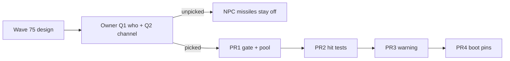

# NPC missiles / incoming warning shared contract

**Wave:** 75. Design only. No `src/` in this wave.  
**Status:** MERGE LAW for the integrator. If a sibling note and this file conflict, **this file wins**.  
**Not this wave:** any edit under `src/`, `scripts/`, `public/`, `index.html`, `package.json`. Do not edit the wishlist, `PROGRESS.md`, or [`docs/Shp03WeaponsDesign.md`](../../../docs/Shp03WeaponsDesign.md).  
**Locked sources:** live code cited in [`current-npc-missiles-inventory.md`](current-npc-missiles-inventory.md); `docs/Shp03WeaponsDesign.md` player dart + first-impl “no NPC missiles”; HUD-01 `docs/HudUtilityChangeProposal.md`; HUD-02 `docs/Hud02IdentitiesDesign.md`; TGT-05 `docs/Tgt05ReticleLockDesign.md`; AI-04 / TGT-03 remaining in `docs/PLAYER-EXPERIENCE-WISHLIST.md`; Wave 57 lastAttacker law in `npc.js` / `combat.js`.

[`docs/Shp03WeaponsDesign.md`](../../../docs/Shp03WeaponsDesign.md) remains the **player-weapons** record (Wave 67/68). It still says no NPC missiles in the first impl. **This contract supersedes that freeze for a later implementation wave only.** Wave 68 stays shipped without NPC missiles.

---

## 0. Law in one page

1. **HUD-01 / HUD-02 stay closed.** No incoming-missile gauge, lock box, aspect ring, 13 s timer, or new `#hud` glance node on the aim glass. Empty 80 px hub stays empty.
2. Incoming warning, if any, uses an **existing off-column channel**: `commLine` toast and/or FORE/AFT and/or a song cue. Prefer reuse. At most **one** new frozen event, and only if an existing emit would lie.
3. NPC missiles are **not** a player SKU. Do **not** add a second `LAUNCHER_IDS` row unless inventory requires it (it does not). Reuse `WEAPONS.missile` + `steerSeekerVel`. Give NPCs a **smaller separate pool**.
4. Who fires is a **fail-closed role subset**. Default until the owner picks: **nobody** (no NPC missiles). Proposed subset: `pirate` and `ace` (Named Guns / aspirants included as `ace`). **Not** `trader`. **Not** `miner`. **Not** `patrol` unless the owner later says yes. **Not** a Beautiful-faction grant. **Not** Unknowables.
5. Do **not** invent a fire percent. Personality is resolve, not a dart dice. If a cadence mix is required, mark **proposed, needs owner** and keep darts **off** until authored.
6. Unknowables: darts do not damage them (`applyHit` non-beam). NPC Unknowables **must not** fire darts (beam-only fiction).
7. Seeker vs player uses the **existing player-hit path** (`testPlayerHit`). Ship-vs-ship seekers **must not** `testPlayerHit`. `lastAttacker === 'player'` remains the only scratch that turns patrols / interest (Wave 57).
8. Zero per-frame allocation on the missile path. Cap live NPC seekers. Exhausted pool → **drop** (player dart precedent). Fail closed.
9. **No chaff.** Player has none. NPC already dodges via flight + PHY lookahead. Incoming warning is the new counterplay, not a new equipment SKU.
10. NPC player-style `auto` turret stays **out** (SHP-03). Do not sneak it in with darts.
11. Power ledger stays **out**. Heat stays the shipped `HEAT` pool. NPC darts do not spend player `missileAmmo`.
12. `state.js` is **READ-ONLY**. Digit 0 Shipyard untouched. Digit 8/9 outfitting untouched.
13. `textContent` only. No `innerHTML`. Prototype-safe. Event payloads must not stringify attacker names into HTML. Toast copy is **authored literals**.
14. Wave 75 writes markdown only. Serial PR plan later. Do not implement here.

---

## 1. HUD (closed)

### 1.1 Forbidden glance

| Forbidden | Why |
|---|---|
| Incoming-missile gauge, hub lamp, wedge, missile edge-arrow restyle | HUD-01 aim glass; HUD-02 non-goal; SHP-03 Frozen 3 |
| Lock box, aspect ring, hold-to-lock timer | HUD-01 / HUD-02; player dart already uses `ctx.targets.current` |
| New `#hud` child for inbound count / aspect | Performance contract: nodes created once in `initHud` |
| Power / mass bar | SHP-03 Frozen 9 |

WPN group 4, RANGE, and advisory lead stay as Wave 68 shipped them. This wave does not change player WPN copy.

### 1.2 Allowed warning channels (existing)

Pick at impl time from this closed list. Owner must pick **before** darts fire at the player. Until then, NPC missiles stay **off**.

| Channel | Live behavior | Honest use for inbound dart |
|---|---|---|
| HUD toast via `npcFire` | `toastForEvent` ignores `npcFire` today (`default` → null). Off-column. `textContent`. | **Proposed:** one authored literal when `weapon === 'missile'` and the shot is vs player. Do **not** interpolate `ship.state.name` / `e.from`. |
| `commLine` | Off-column. Displays `e.text`, ignores `from`. Used for hail voice. | **Alt (owner):** same authored literal via `commLine`. Then do **not** also toast `npcFire` (double toast). Do not put names in `text`. |
| Song | `npcFire` plays cannon bark today. | Branch on `weapon === 'missile'`. Do not leave the cannon bark on a dart. Not a second toast. |
| FORE/AFT | Flashes on `playerHit` (impact). | **Default: leave hit-only.** Dual-use as inbound would lie about a hit. Owner may reopen this only as a glance flash without a new node. |

**Proposed (needs owner):** **one** toast path (`toastForEvent` on missile `npcFire`) **plus** song branch. Do not emit `commLine` and an `npcFire` toast for the same spawn. FORE/AFT stays impact-only.

**Default if unpicked:** no warning **and** no NPC missiles.

Banner stays `systemLoaded`. Do not steal it for inbound darts.

---

## 2. Events

### 2.1 Prefer reuse

| Emit | Reuse? |
|---|---|
| `npcFire { ship, weapon, target }` | **Yes.** Set `weapon: 'missile'`. **Always set `target`** (`'player'` in the first slice). Do **not** omit `target` (ace cannon legacy would make combat assume player — keep that lie out of darts). Update the `ctx.js` frozen comment in the impl PR that first emits it. |
| `playerFire` | Player only. Do not emit for NPC darts. |
| `playerHit` | Impact only. NPC dart vs player still emits this when `testPlayerHit` succeeds. |
| `commLine { text, from }` | Hail voice stays. Incoming warn uses this **only** if Q2 picks it **instead of** an `npcFire` toast. `text` = authored constant. HUD must not print `from`. |

### 2.2 New event (cap 1)

A new frozen type (example name `incomingDart`) is **not frozen** and **not required**.

Add one new type **only** if reuse would lie (for example: toasting every `npcFire` would spam cannon volleys, and branching in `toastForEvent` on `weapon` is rejected by the impl owner). Until then: **no new type**.

If added, payload is **booleans / enums only** (`{ vsPlayer: true }`). No name strings. No HTML. `ctx.js` comment updates in that same PR.

### 2.3 Song

`npcFire` with `weapon: 'missile'` must not keep the cannon bark. Impl may add a row in `CUES` keyed by existing type + weapon branch, or a dedicated cue table entry still triggered from `npcFire`. That is not a new frozen ctx event.

---

## 3. Who fires (fail closed)

### 3.1 Live gates (do not widen)

Cite `mayHuntPlayer` / `isCivilianRole` (`npc.js` 1061–1073):

- `trader` / `miner` → **never** hunt, **never** dart.
- `patrol` → may already cannon the player when scratched by the player or standing ≤ −10. Dart default **off** for patrols.
- `pirate` / `ace` → eligible hunters. **Proposed** dart subset.

Named Guns and aspirants are `role: 'ace'` (`world.js`, `NAMED_GUNS`). They ride the ace gate. Do not add a name allowlist.

Beautiful Ones: systems exist; `npc.js` has **no** beautiful hunt special. **No faction grant.** A Beautiful hull fires a dart only if it is `pirate` or `ace` **and** the owner has turned the subset on. BIO Abominations (later) must not sneak darts in here.

Unknowables: `isUnknowable(faction)` → **never** emit missile `npcFire`. Never seat an NPC dart.

### 3.2 Owner pick (blocks impl)

**Q1 — Who fires?**  
Proposed: `pirate` and `ace` only, and only while `ai.target === 'player'` (or ace duel vs player). Ship-vs-ship darts are a later slice (see §4.3).  
Default: **no NPC missiles**.

**Q2 — Cue vs toast?**  
Proposed: one HUD toast from missile `npcFire` (authored literal) + song branch on the same emit. FORE/AFT stays hit-only. Do not double with `commLine`.  
Default: **no warning and no NPC missiles**.

Do not ship a random percent. If a later owner wants “sometimes cannon, sometimes dart,” they author a cadence in the impl contract addendum. Unset cadence → cannon only.

Telegraph ≥ 3 s before the **first** shot stays (`npc.js` 37–39). Darts do not skip telegraph.

---

## 4. Combat (later impl, grounded in live combat)

### 4.1 Pool / alloc

- Keep player `MISSILE_POOL` 8 (`combat.js` 165).
- Add a **separate** NPC missile pool. Suggested cap **4** live NPC seekers (starting number for the impl PR; not persist). Do not share the player 8 and starve the dart rack. Do not share the 64-bolt pool.
- Module-scope scratch only (`steerSeekerVel` already). No per-frame `Vector3` / array alloc.
- Exhausted NPC pool → drop the shot. No alloc. No fake hitscan.
- NPC darts do **not** call `spendMissileAmmo`. That helper is the player hangar row.

### 4.2 Spawn path (must not lie)

**Forbidden:** `spawnNpcShot(..., 'missile', ...)` as it exists today. That function `spawnProjectile`s into the bolt pool with no seeker (`combat.js` 1230–1250).

**Required:** a spawn that:

1. Takes a free NPC (or shared-but-capped) missile slot.
2. Sets `fromPlayer = false`.
3. Sets `shooter` to the live NPC.
4. Sets `lock` to the aim object (player ship or live NPC).
5. Sets `vsPlayer = true` **iff** the aim is the player.
6. Uses `WEAPONS.missile` numbers (reuse). `state.js` stays READ-ONLY — no `WEAPONS.npcMissile` row in a feature PR.
7. The matching `npcFire` always includes **explicit** `target` (`'player'` in the first slice). Ace vs player copies `target: 'player'`. Ace cannon’s omitted `target` (`npc.js` 1872) is **not** copied. Missing-target-means-player (`combat.js` 1672–1675) is **forbidden** for missiles: if `weapon === 'missile'` and `target` is missing, **drop** the shot. Do not aim the player.

If catalog numbers must differ (smaller NPC damage), that is a **dedicated `state.js` PR** first. Default: **same row**, smaller pool.

### 4.3 Hit tests (Wave 57)

Live bolt law is the tick split (`combat.js` 1716–1718):

`(fromPlayer || !vsPlayer) ? testNpcHits : testPlayerHit`

- Player shot → `testNpcHits`
- NPC vs player (`vsPlayer === true`) → `testPlayerHit`
- NPC vs NPC → `testNpcHits`, **never** `testPlayerHit`

Do **not** treat the file header at `combat.js` 35–36 as law. That sentence (“Player-aimed bolts use testPlayerHit only; ship-aimed bolts use testNpcHits and never testPlayerHit”) is **stale** vs the live split. NPC-vs-player bolts **do** call `testPlayerHit`. NPC-vs-NPC bolts must not.

Missile tick today always `testNpcHits` (`combat.js` 1738) because only the player fires darts.

Later NPC dart tick:

| Shot | `fromPlayer` | `vsPlayer` | Hit test |
|---|---|---|---|
| Player dart vs NPC | true | false | `testNpcHits` only (unchanged) |
| NPC dart vs player | false | **true** | `testPlayerHit` only |
| NPC dart vs NPC | false | **false** | `testNpcHits` only. **No** `testPlayerHit` |

`testPlayerHit` is the existing player-hit path (`combat.js` 1566–1582): true radius, no padding, facet FORE/AFT, `applyHit` on `ctx.player`, emit `playerHit`.

`lastAttacker` stamp stays inside `testNpcHits` (`combat.js` 1541):

- Player dart vs NPC → `'player'` (scratch law intact).
- NPC dart vs NPC → `p.shooter` (or `'npc'`). Must **not** write `'player'`.
- NPC dart vs player → no NPC `lastAttacker` write (player is not that record).

A ship-vs-ship dart that also called `testPlayerHit` would let a pirate-vs-trader shot bruise the player and could mis-scratch patrols. **Forbidden.**

First impl slice **may** fire NPC darts **only vs the player** (`target: 'player'`). Ship-vs-ship darts wait. That keeps the Wave 57 path small.

### 4.4 Unknowables

- `applyHit` already returns `[]` for non-beam vs Unknowable (`state.js` 167–171).
- `testNpcHits` already skips Unknowable hulls without consuming the projectile (`combat.js` 1458–1459).
- Gate: Unknowable NPCs do not emit missile `npcFire`.
- Player darts still miss Unknowable fields. Do not reopen Wave 9.

### 4.5 Turret / power / persist

- NPC `auto` turret: **out**.
- Power ledger: **out**.
- `state.js`: **READ-ONLY** in the NPC-missile feature PRs.
- Digit 0 / 8 / 9: **untouched**.
- No hangar key for NPC racks. No second player `LAUNCHER_IDS` row.
- `input.weaponGroup` stays session. NPCs do not read it.

---

## 5. Counterplay

| Threat | Answer |
|---|---|
| Player dart vs NPC | Already: capped turn 0.85, speed 260 vs cutter cruise 105, NPC flight + PHY avoid. No chaff. |
| NPC dart vs player | **Incoming warning** (owner-picked channel) + the same dodge. No chaff SKU. No new equipment Digit. |
| Heat / ammo (player) | Unchanged Wave 68. |
| Heat (NPC) | Optional. Default: NPCs have no heat lock for darts (they have none for cannon). Do not invent an NPC heat persist. |

---

## 6. XSS / prototype / save

1. Toast / banner / WPN: `textContent` / `h()` only. No `innerHTML`.
2. Incoming copy: authored string constants in source. Never `String(ship.state.name)` / record name in the toast body.
3. `commLine.from` may remain the live name (existing `say`). HUD incoming path **must not** display `from`.
4. New event payloads: no attacker-name fields.
5. NPC dart does not grow hangar / `WORLD_FIELDS`. No `sessionStorage` missile debug as save.
6. Fresh literals on any future sanitize. Drop `__proto__` / `constructor` ids if a catalog ever grows. Prototype-safe reads (`Object.hasOwn`).

Threat model: local browser game. Fail closed on role, faction, pool, and hit-test split.

---

## 7. Serial PR plan (later wave — do not run in Wave 75)

| PR | What | Touches `state.js`? |
|---|---|---|
| **PR0** | Inventory pins in boot-test / comments only as needed. Owner answers Q1/Q2 recorded. | No |
| **PR1** | NPC fire gate (`pirate`/`ace` or **off**) + NPC missile pool + spawn that is **not** `spawnNpcShot` | No |
| **PR2** | Hit tests: `vsPlayer` split on the missile tick. Wave 57 pins. Unknowable skip. | No |
| **PR3** | Warning channel (toast and/or song). `ctx.js` comment if `npcFire` payload grows. At most one new event if reuse lies. | No |
| **PR4** | Boot pins: no HUD node, Unknowables miss, lastAttacker, pool drop, XSS `textContent` | No |

Do not land PR1 while Q1 is unpicked (keep emit off). Do not land PR3 while Q2 is unpicked (keep warning off). A catalog damage fork, if any, is a **dedicated** `state.js` PR **before** PR1.

Rollback: revert the failed PR. Player dart pool and hangar keys stay.

---

## 8. Coupling (do not reopen)

| Surface | Freeze |
|---|---|
| SHP-03 player dart / Digit 8/9 / `LAUNCHER_IDS.dart` | Closed. Point at `docs/Shp03WeaponsDesign.md`. |
| HUD-01 / HUD-02 | Closed. No gauge. |
| TGT-05 | Player lock stays KeyT/KeyV + `ctx.targets.current`. NPC dart lock is the aim object, not a new player instrument. |
| PHY | Avoid stays lookahead. Do not add seekers as PHY bodies in this slice. |
| AI-04 | Do not widen `mayHuntPlayer`. Darts ride existing hunters. |
| Unknowables beam-only | Closed. |
| BIO living HUD family | No new glance node. `hudFamily` still follows `hullKind`. |
| TGT-04 NPC turret | Still later. Not this contract. |
